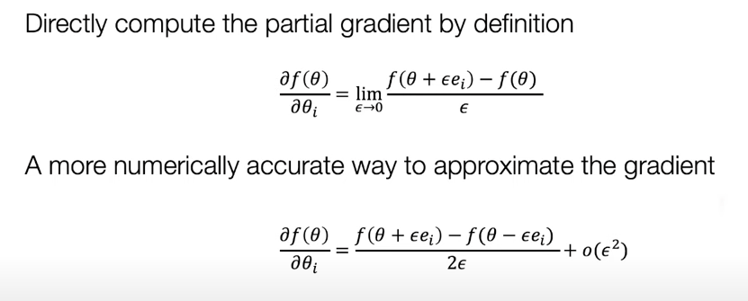
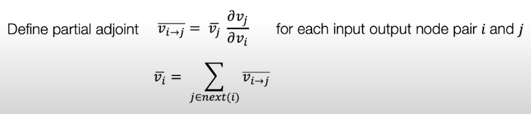

Notes For Dlsys
---
The previous 3 courses covers too basic knowledge and can hardly have understanding. We directly start from the course 4.
# Auto Diff

有两种 Numerical Diff 计算方式
- By Definition: used in practice 但是 o(e) 的误差
- Numerical Correct: less efficient, o(e^2)
  - Use to check implementation

Reverse mode automatic differentiation (AD)
- save comp

## Partial 的计算表示

## Reverse Vs. Backprop
Backprop:
- no additional graph is created.
- Repeating computation of previous
Reverse Mode AD
- 

